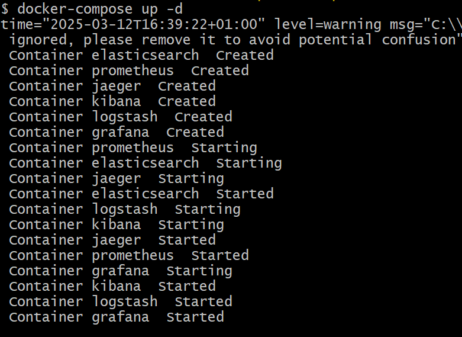

# Gestion des utilisateurs

Mini projet pour s'entrainer la création des APIs Rest avec Java Spring et Spring boot

## Technologies Utilisées

- **Java 17** : Langage de programmation utilisé pour le développement de l'application, choisie pour sa robustesse, sa sécurité et sa portabilité.
- **Spring Boot 3.3.4** : Framework permettant de simplifier la configuration et le déploiement des applications Java. Utilisé pour sa capacité à automatiser la configuration de nombreux aspects de l'application.
- **Maven** : Outil de gestion et d'automatisation de la construction des projets logiciels principalement pour Java. Utilisé pour gérer les dépendances, la construction du projet, et le déploiement.
- **Spring Data JPA** : Module de Spring permettant une intégration fluide avec les bases de données au moyen de JPA pour l'accès aux données relationnelles.
- **Spring Web MVC** : Framework de Spring utilisé pour construire des applications web et des services RESTful avec des configurations minimales.
- **H2 Database** : Base de données en mémoire utilisée pour les tests et le développement local, permettant une simulation rapide d'environnement de base de données.
- **Spring Security** : Framework de sécurité robuste pour les applications Java qui fournit une authentification et une autorisation complètes.
- **Lombok** : Bibliothèque Java qui se plugue automatiquement à votre éditeur et à vos outils de build pour éliminer le boilerplate du code Java.
- **MapStruct** : Outil de mappage Java Bean utilisé pour simplifier le mappage automatique entre différents modèles de données dans l'application.
- **JUnit** : Framework de test pour Java permettant d'écrire et de courir des tests répétables avec des assertions structurées.
- **JWT (JSON Web Token)** : Standard ouvert utilisé pour la création de tokens d'accès qui permettent la propagation d'identité et de privilèges.
- **Logstash Logback Encoder** : Utilisé pour intégrer les logs structurés JSON avec Logstash et ElasticSearch.
- **Micrometer avec Prometheus** : Système de monitoring et d'instrumentation qui expose des métriques d'application, compatible avec plusieurs systèmes de monitoring.
- **OpenTelemetry Jaeger** : Framework de traçage distribué, utilisé pour observer les interactions entre services dans une architecture microservices.


## Installation

1. Clonez le dépôt :
   ```bash
  git clone https://github.com/mouktar-hassan/rest-api-gestion-users.git

## Monitoring et Observabilité

Ce projet inclut une configuration de monitoring avancée utilisant plusieurs services pour surveiller et visualiser les performances de l'application :

- **Elasticsearch** : Moteur de recherche et d'analyse utilisé pour indexer et rechercher des logs.
- **Logstash** : Pipeline de traitement de données pour collecter, enrichir et transporter les logs vers Elasticsearch.
- **Kibana** : Interface utilisateur pour visualiser les données d'Elasticsearch et créer des tableaux de bord.
- **Prometheus** : Système de monitoring qui collecte et stocke ses métriques sous forme de séries temporelles.
- **Grafana** : Outil d'analyse et de visualisation de métriques qui peut intégrer des données de sources multiples comme Prometheus.
- **Jaeger** : Outil de traçage distribué pour analyser les interactions entre services.

### Commandes Docker Essentielles

Pour manipuler les services de monitoring définis dans le fichier `docker-compose.yml` situé dans le répertoire `monitoring`, voici quelques commandes Docker essentielles :

1. **Démarrer tous les services de monitoring** :
Lancer l'application Docker desktop dans votre local (Docker desktop sert d'interface pour gérer les conteneurs Docker et les configurations réseau, et il doit être actif pour que les commandes docker et docker-compose fonctionnent correctement.)
Placer vous dans le répertoire /monitoring dans votre projet puis ouvrir le terminal pour exécuter :
   ```bash
   docker-compose up -d
Vous devrez avoir :


2. **Vérifier le statut des conteneurs** :

* Vous pouvez vérifier que vos conteneurs s'exécutent correctement en utilisant :
   ```bash
   docker-compose ps
* Ou vérifiez les logs des conteneurs pour identifier des erreurs ou des messages de statut :
   ```bash
  docker logs [nom-du-conteneur]
  
3. **Arrêter tous les services de monitoring :**

   ```bash
   docker-compose down
   

## Utilisation

Après avoir démarré les services, accédez aux interfaces web des outils pour consulter les métriques et logs :

* Kibana : http://localhost:5601
* Prometheus : http://localhost:9090
* Grafana : http://localhost:3000
* Jaeger UI : http://localhost:16686

